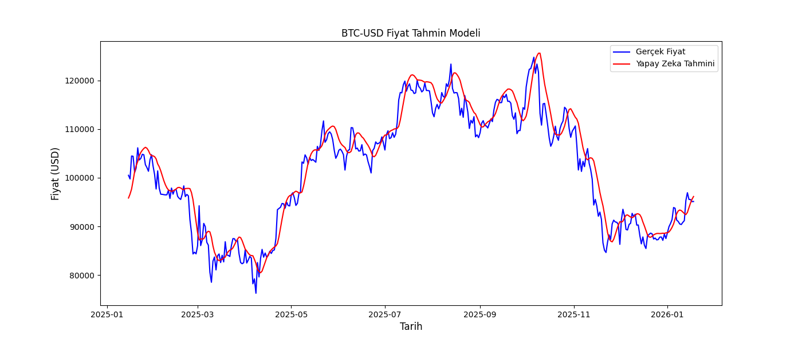

#Crypto Price Prediction Model (LSTM)

This project aims to predict the future price movements of cryptocurrencies (such as Bitcoin, Ethereum, etc.) using Machine Learning and Neural Networks. The model utilizes the **LSTM (Long Short-Term Memory)** architecture, which is highly effective for time-series data analysis.

#Project Visualization
Below is the visualization of the model's test performance and future predictions based on historical data:



#Tech Stack
This project is built with the most powerful libraries in the data science and AI ecosystem:

* **Python 3.11** - Core programming language.
* **TensorFlow & Keras** - For building and training the deep learning model (LSTM).
* **Pandas & Numpy** - For data manipulation and numerical analysis.
* **Matplotlib** - For data visualization and plotting results.
* **Scikit-Learn** - For data preprocessing and normalization (MinMaxScaler).
* **yFinance** - For fetching live and historical market data from Yahoo Finance.

#Installation & Usage
To run this project on your local machine, follow these steps:

1. **Clone the repository:**
   ```bash
   git clone [https://github.com/Mazlum3476/crypto_prediction.git](https://github.com/Mazlum3476/crypto_prediction.git)
   cd crypto_prediction
